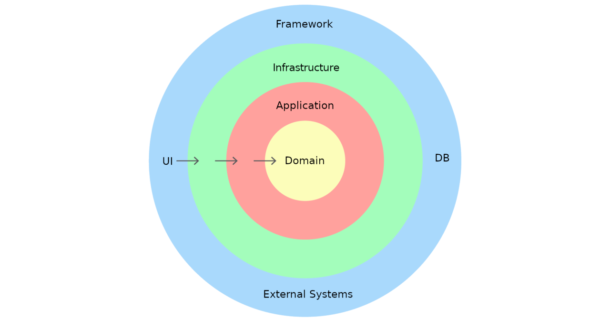

## Description

This project is an API built using [Nest](https://github.com/nestjs/nest) and [GraphQL](https://graphql.org/).

The source code has been organized using an approach based on [Domain Driven Design](https://en.wikipedia.org/wiki/Domain-driven_design).

Each module on the source code is divided on three different folders, which are `domain`, `application` and `infrastructure`.
The image below pictures why is the need of such layers.



By doing it this way we can have the different responsibilities of the code in different places:
- `domain` contains the core elements that we deal in our business, on there we model our objects to represent the business 
domain we work on.
- `application` contains the business logic in form of our user stories, every feature has a place.
- `infrastructure` contains everything we need in order to make our application able to interact with the external world, 
either that be a database, a user interface or another services.

By organizing our code this way we can safely implement any feature or logic, while keeping confidence that in the future
we will be able to change any piece of infrastructure without our core logic having to be touched.

It also ensures that each layer of the system is easily testable, either with unit tests by mocking the other layers, or
with integration tests by deciding which layers we want to test together.

Using this approach we consider unit tests anything that tests a single layer, and integration tests anything that tests more 
than one layer at the same time.

## Installation

```bash
$ yarn install
$ cp .env.example .env
```

## Running the app

```bash
# start database
$ make start

# development
$ yarn run start

# stop database
$ make stop
```

## Decisions log

- A database is required to run the API, Docker is used to spin a local instance of MariaDB.
- To define the schema of the GraphQL server, a `Schema first` approach is used because I like to have the schema to be 
explicitly defined, plus in my opinion, it makes it less verbose when there are response objects that don't follow the 
definition of your domain objects.
- The protected endpoints from the `Nft` module can only be accessed when a valid JWT is used. When that is the case,
the user can only list and transfer its own assets.
- There is no unit tests because there is no real domain logic implemented on the application or domain layer. 
Integration tests would be interesting on this solution, but these were not the purpose of this example.

## Possible improvements

With more time, these are some changes I would do on the project:
- Configure the GraphQL so the autogenerated classes and interfaces would be inside each module's folder.
Makes it easier to import generated types, and it keeps everything more closely coupled.
- Add validation in the data that comes from the GraphQL payload.
- Add integration tests to verify the behavior on the repositories and application services.
